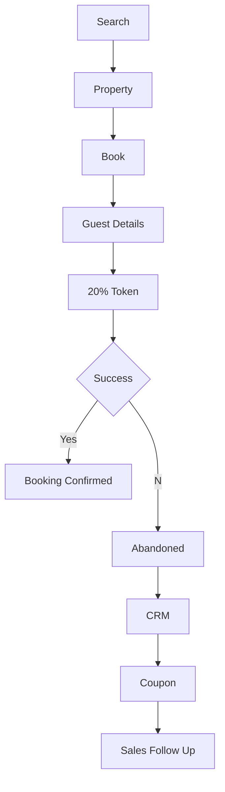

# StayGrid MASTER_CONTEXT_P1.md

> Purpose: This document is the single source of truth for an AI coding agent (Claude Code/Cursor/Codex) to build the Phase 1 StayGrid monorepo.

## 1. Product Overview

StayGrid is a farmhouse booking marketplace.

Actors:
- Customer (Mobile App)
- Farmhouse Owner (Owner Portal)
- StayGrid Admin (System Admin ERP)

Revenue:
- 20% booking token collected through app.
- StayGrid commission from owner.
- Featured listings.
- Advertisements.
- Promotional packages.
- Instagram / YouTube promotions.

---

# 2. Deliverables

Build ONE monorepo containing:

- Mobile App (iOS + Android)
- Owner Web Portal
- System Admin ERP
- Shared backend
- Shared UI components

---

# 3. Customer Mobile App

## Authentication
- Splash
- Onboarding
- Login
- Signup
- OTP
- Google Login
- Apple Login
- Forgot Login
- Profile Completion

Collect:
- Name
- Email
- Mobile
- Gender
- DOB
- City

## Home

Sections

- Hero Banner
- Search
- Featured
- Trending
- New Farmhouses
- Couple Friendly
- Family Friendly
- Luxury
- Weekend Deals
- Last Minute Deals
- Nearby
- Recently Viewed
- Refer & Earn
- FAQ

## Search

Filters

- Location
- Date
- Guests
- Adults
- Children
- Price
- BHK
- Pool
- Lawn
- BBQ
- Pet Friendly
- Couple Friendly
- Alcohol Allowed
- Music Allowed
- Parking
- Caretaker
- WiFi
- Hygiene Rating

Sort

- Price Low
- Price High
- Popular
- Rating
- Distance

## Property Detail

- Gallery
- Photos
- Amenities
- Description
- Capacity
- Pool Size
- Rules
- Checkin
- Checkout
- FAQ
- Map
- Instagram Reel
- Similar Properties
- Reviews
- Availability Calendar
- Book Now

## Booking

Collect

- Dates
- Adults
- Children
- Handler Phone
- Occasion
- Notes

Payment

- 20% token

If payment fails:
- Save abandoned booking
- Notify Admin
- Notify Owner
- Trigger coupon workflow

---

# 4 Owner Portal

Modules

- Dashboard
- Farmhouses
- Calendar
- Bookings
- Payments
- Earnings
- Amenities
- Photos
- Pricing
- Offers
- Last Minute Deals
- Promotional Video Request
- Featured Listing Purchase
- Analytics
- Reviews
- Support
- Profile

Mandatory first login

- Complete profile
- KYC
- Bank Details
- Upload property
- Upload images
- Set next 90 days availability

---

# 5 System Admin ERP

Modules

- Dashboard
- Users
- Owners
- Farmhouses
- Bulk Upload
- Booking Management
- Payment Verification
- Refunds
- Coupons
- CRM
- Kanban
- WhatsApp Campaigns
- Push Notifications
- Homepage CMS
- Banners
- Featured Listings
- Advertisements
- Analytics
- Reports
- Roles & Permissions
- Audit Logs
- Support Tickets

---

# 6 CRM Pipeline

New Lead
→ Viewed Listing
→ Viewed Gallery
→ Clicked Book
→ Payment Pending
→ Coupon Sent
→ Sales Called
→ Token Paid
→ Booking Confirmed
→ Completed
→ Referral

---

# 7 Notifications

Customer
- Booking
- Reminder
- Coupon
- New Property
- Last Minute Deal

Owner
- New Booking
- Payment Pending
- Calendar Update
- Promotion Approved

Admin
- New Owner
- Booking
- Refund
- Abandoned Booking
- Failed Payment

---

# 8 Business Rules

- Owner cannot receive booking without availability.
- Calendar mandatory.
- 20% token mandatory.
- Remaining amount paid onsite.
- Owner confirms cash received.
- Admin closes booking.
- Reviews only after completed stay.
- Featured listings rank above normal.

---

# 9 Mermaid Booking Flow

# 10 AI Instructions

Read this document before generating code.

Do not invent features.

Do not skip modules.

Generate complete monorepo.

Every screen must include:
- loading state
- empty state
- error state
- validation
- analytics event
- notification hooks

Generate production-ready code only.

This document is Phase 1 and should be treated as the source of truth.
