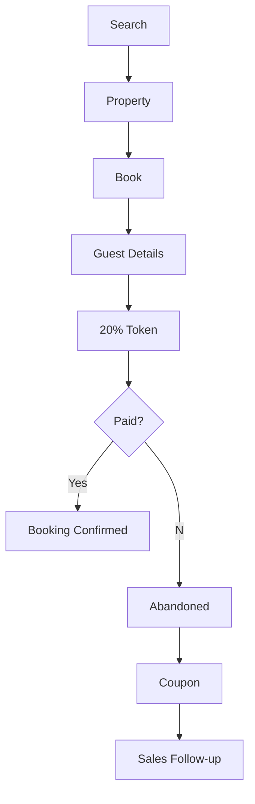
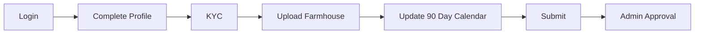
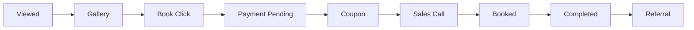
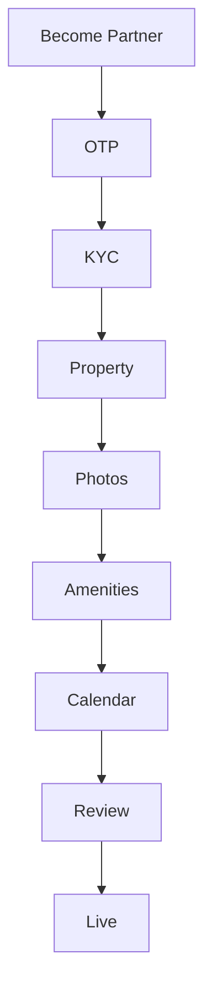

# StayGrid Product Requirements Document (Master PRD)

> **Status:** Foundation Document (Version 1.0)

> This document is intended to become the single source of truth for the StayGrid platform.
> It will eventually grow to 200–400+ pages. This starter contains the complete structure,
> business rules, and representative sections in Markdown with Mermaid diagrams.

---

# Table of Contents

1. Vision
2. Business Model
3. Stakeholders
4. User Personas
5. Customer Mobile App
6. Owner Portal
7. System Admin ERP
8. Farmhouse Onboarding
9. Booking Lifecycle
10. Payment Lifecycle
11. CRM Pipeline
12. Notification Engine
13. Marketing Automation
14. Reports & Analytics
15. Monetization
16. Roadmap

---

# 1 Vision

StayGrid is a marketplace focused on farmhouse bookings. Unlike Airbnb,
StayGrid already owns demand through Instagram and YouTube and will digitize
its booking operations.

Goals:
- Increase bookings
- Reduce manual operations
- Increase owner retention
- Increase repeat customers
- Build CRM

---

# 5 Customer Mobile App

## Authentication

- Mobile OTP
- Email
- Google Login
- Apple Login
- Referral Code
- Location Permission

## Home

- Search
- Featured
- Last Minute Deals
- Nearby
- Couple Friendly
- Family Friendly
- Birthday
- Corporate
- Trending

## Search Filters

- Price
- BHK
- Adults
- Children
- Pool
- Lawn
- Alcohol Allowed
- Couple Friendly
- Pet Friendly
- Caretaker
- Parking
- BBQ
- Music
- Rain Dance
- Hygiene
- Featured
- Instant Book

## Property Details

- Gallery
- Amenities
- Availability Calendar
- Rules
- House Policies
- Reviews
- Instagram Reel
- Similar Properties
- FAQ

---

# Booking Flow

Business Rules

- Token = 20%
- Remaining paid to caretaker
- Owner confirms cash received
- Admin verifies booking closure

---

# Owner Portal

Modules

- Dashboard
- Calendar
- Add Property
- Edit Property
- Amenities
- Pricing
- Promotions
- Last Minute Deals
- Analytics
- Earnings
- Cash Collection
- Promo Video Request
- Featured Listing Purchase

## First Login

Rules

- Calendar mandatory
- Photos mandatory
- GPS mandatory
- At least one contact person

---

# System Admin ERP

Modules

- Dashboard
- Bulk Upload
- Owner Verification
- Booking Verification
- Commission
- CRM
- Coupons
- WhatsApp Campaigns
- Push Notifications
- Reports
- Roles
- CMS
- Featured Listings
- Advertisement

---

# CRM Kanban

---

# Farmhouse Onboarding

## Existing Inventory

System Admin uploads:

- CSV
- Photos
- Amenities
- Pricing
- Capacity
- Rules

## New Owner

---

# Notifications

Customer
- Booking
- Reminder
- New Farmhouse
- Discount

Owner
- New Booking
- Payment Pending
- Calendar Reminder

Admin
- Abandoned Booking
- New Owner
- Refund
- Commission

---

# Monetization

- Booking Commission
- Featured Listings
- Sponsored Ads
- Premium Owners
- Photography
- Social Media Promotions
- Referral Campaigns

---

# Roadmap

Phase 1
- Booking
- Payments
- Owner Portal
- Admin

Phase 2
- CRM
- WhatsApp
- Ads
- Analytics

Phase 3
- AI Recommendations
- Loyalty
- Dynamic Pricing
- Corporate Bookings

> **NOTE**
>
> This markdown is the starter master document.
> The final version requested will expand every module into detailed functional
> requirements, acceptance criteria, business rules, screen-by-screen specs,
> and 100+ Mermaid diagrams.
